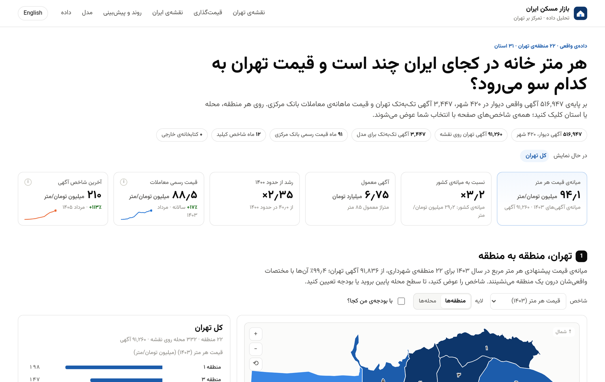
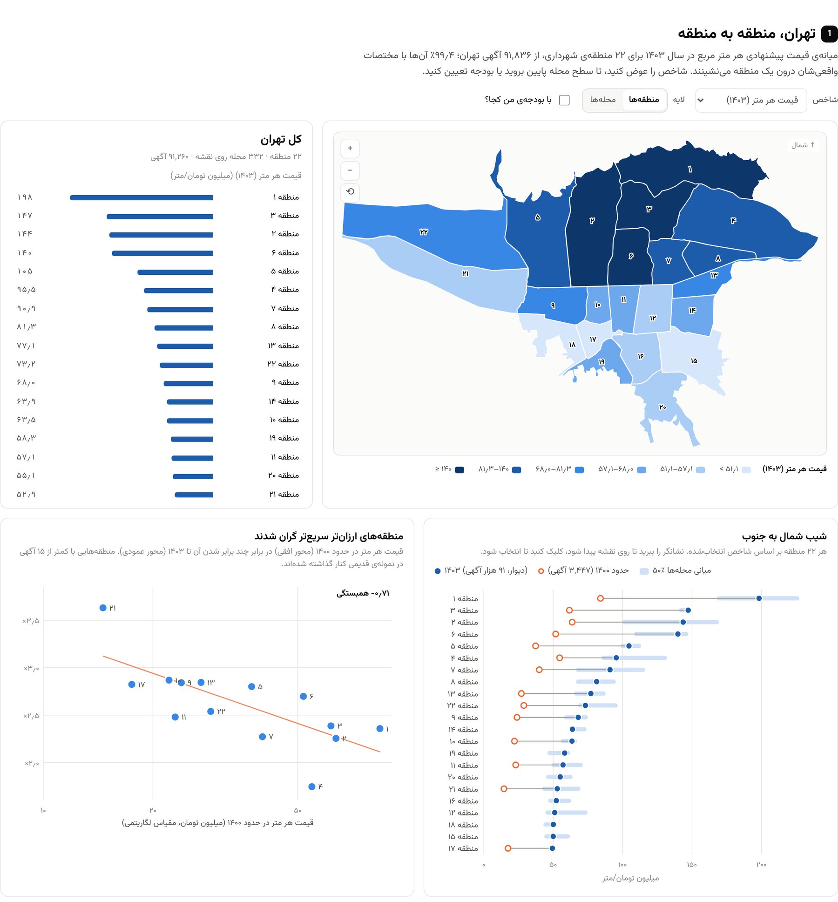

<div dir="rtl">

# تحلیل بازار مسکن ایران و تهران

**هر متر خانه در کجای ایران چند است و قیمت تهران به کدام سو می‌رود؟** داشبوردی تعاملی و نقشه‌محور از بازار مسکن ایران با تمرکز منطقه‌به‌منطقه بر تهران؛ ساخته‌شده روی آگهی‌های واقعی و قیمت معاملات بانک مرکزی، همراه با مدل قیمت‌گذاری‌ای که در خود مرورگر اجرا می‌شود و پیش‌بینی‌ای که بازه‌ی خطایش از ۳۵ آزمون تاریخی آمده است.

**[داشبورد زنده (فارسی)](https://milad-shabani.github.io/Iran-housing-market-analytics/index.fa.html)** · **[English](https://milad-shabani.github.io/Iran-housing-market-analytics/)** · [README انگلیسی](README.md)

<p align="center"></p>

## چه چیزی در آن هست

| بخش | توضیح |
|---|---|
| **نقشه‌ی تهران** | ۲۲ منطقه‌ی شهرداری با ۸ شاخص (قیمت هر متر، رشد، قیمت معمول، متراژ، سال ساخت، سهم آسانسور و پارکینگ، حجم نمونه). تا سطح ۳۳۲ محله پایین بروید، بزرگ‌نمایی کنید، یا بودجه بدهید و ببینید کدام محله‌ها در حد آن‌اند. |
| **قیمت‌گذاری** | محله، متراژ، تعداد اتاق، پارکینگ، انباری و آسانسور را انتخاب کنید. برآورد با بازه‌ی ۸۰٪، شکستن گام‌به‌گام، جایگاه در توزیع قیمت محله و اینکه همین پول در منطقه‌های دیگر چند متر می‌شود. |
| **نقشه‌ی ایران** | ۳۱ استان و ۳۴۹ شهر از ۵۱۴٬۲۸۲ آگهی واقعی. روی هر استان کلیک کنید تا شهرهایش را ببینید. |
| **روند و پیش‌بینی** | سری ماهانه‌ی بانک مرکزی برای تهران (۱۳۹۵ تا ۱۴۰۳)، شاخص آگهی کیلید (۱۴۰۴ تا ۱۴۰۵) و چشم‌انداز ۱۲ ماهه با روشی که آزمون گذشته‌نگر انتخابش کرده. فرض رشد را عوض کنید و جابه‌جایی بازه را ببینید. |
| **مدل** | دقت با اعتبارسنجی متقاطع، ارزش هر ویژگی، قیمت پیش‌بینی‌شده در برابر قیمت آگهی. |

همه‌ی کاشی‌ها و نمودارها از انتخاب شما پیروی می‌کنند: روی منطقه‌ی ۳ کلیک کنید تا شاخص‌ها، پنل کناری، رتبه‌بندی و نمودار پراکنش همه به منطقه‌ی ۳ بروند.

## یافته‌ها

۱. **شیب شمال به جنوب ۴ برابر است.** میانه‌ی قیمت پیشنهادی منطقه‌ی ۱ در ۱۴۰۳، **۱۹۸ میلیون تومان** برای هر متر است و منطقه‌ی ۱۷، **۴۹٫۴ میلیون**. سه منطقه‌ی گران (۱، ۳ و ۲) همه در شمال‌اند.

۲. **منطقه‌های ارزان‌تر سریع‌تر گران شدند.** بین نمونه‌ی قدیمی دیوار (حدود ۱۴۰۰) و ۱۴۰۳، منطقه‌ی ۲۱ **۳٫۶۳ برابر** و منطقه‌ی ۱ **۲٫۳۶ برابر** شد؛ همبستگی سطح قیمت اولیه و رشد در میان منطقه‌ها **‎−۰٫۷۱‎** است. شهرهای اقماری هم همین را نشان می‌دهند: پردیس **۳٫۹۵ برابر** و شهر قدس **۳٫۴۴ برابر**، در برابر **۲٫۳۵ برابر** برای مناطق تهران.

۳. **پایتخت در لیگ دیگری است.** قیمت متری آگهی‌های استان تهران **۲٫۵ برابر** میانه‌ی کشور است (۷۲٫۷ در برابر ۲۹٫۲ میلیون تومان). رتبه‌ی دوم، هرمزگان، به‌خاطر کیش و بندرعباس ۴۱٫۴ میلیون است و ارزان‌ترین استان کهگیلویه و بویراحمد با ۷ میلیون.

۴. **ادامه دادن رشد سال گذشته بدترین پیش‌بینی است.** روی سری بانک مرکزی، ادامه دادن رشد ۱۲ ماه اخیر در افق یک‌ساله **۳۹٪** خطا دارد و نرخ رشد بلندمدت **۲۱٪**؛ رشد بلندمدت در همه‌ی افق‌های بالای یک ماه بهترین روش از پنج روش است.

۵. **دو سال اخیر داغ‌تر از روند بود.** اگر از آخرین ماه رسمی (مرداد ۱۴۰۳) پیش‌بینی کنیم، روش برتر برای مرداد ۱۴۰۵ عدد **۱۸۵ میلیون** را می‌دهد؛ شاخص آگهی کیلید **۲۱۰ میلیون** است (۱۳٪ بیشتر) و گزارش‌های رسانه‌ای همان ماه بین ۲۰۶ تا ۲۳۳ میلیون‌اند.

۶. **بیشتر قیمت را موقعیت تعیین می‌کند.** مدل «فقط موقعیت» به R² برابر ۰٫۸۷ می‌رسد. با ثابت نگه داشتن محله و متراژ، پارکینگ **۱۸٪**، آسانسور **۹٪** و هر اتاق **۹٪** به قیمت اضافه می‌کند.

<p align="center"></p>

## داده: چه چیزی واقعی است و چه چیزی مشتق

هیچ داده‌ای شبیه‌سازی نشده است. هر فایل در `data/raw/` به یک منبع عمومی برمی‌گردد که در [`scripts/fetch_sources.py`](scripts/fetch_sources.py) ثبت شده است.

| منبع | کاربرد | پوشش |
|---|---|---|
| [مجموعه‌داده‌ی رسمی املاک دیوار](https://huggingface.co/datasets/divarofficial/real_estate_ads) (یک میلیون آگهی، ODbL) از طریق جدول‌های تجمیعی [maminigder/Iran-Real-Estate-Market-Analysis](https://github.com/maminigder/Iran-Real-Estate-Market-Analysis) | محله‌ها و منطقه‌های تهران، شهرها و استان‌ها، شاخص ماهانه‌ی شهرها | ۵۱۶٬۹۴۷ آگهی فروش مسکونی، ۴۲۰ شهر، بیشتر ۱۴۰۳ |
| [قیمت خانه در تهران از دیوار](https://github.com/F-Yousefi/House_Price_Prediction) | آموزش مدل قیمت‌گذاری؛ مقایسه با حدود ۱۴۰۰ | ۳٬۴۷۹ آگهی تک‌به‌تک (۳٬۴۴۷ پس از پاک‌سازی) |
| [بانک مرکزی، گزارش تحولات بازار مسکن تهران](https://www.cbi.ir/category/16994.aspx) | سری رسمی ماهانه، آزمون پیش‌بینی | ۹۱ ماه از ۱۰۱ ماه، ۱۳۹۵/۰۱ تا ۱۴۰۳/۰۵، هر سطر با نشانی منبع |
| [شاخص قیمت تهران در کیلید](https://kilid.com/house-prices/tehran) | آخرین سطح قیمت و پایه‌ی پیش‌بینی | ۱۲ ماه، ۱۴۰۴/۰۶ تا ۱۴۰۵/۰۵ |
| [مرز مناطق تهران](https://github.com/rferdosi/tehran-districts)، [OpenStreetMap](https://github.com/hosseinhabibi2004/iran-geojson) (ODbL) | مرز منطقه‌ها و استان‌ها، موقعیت شهرستان‌ها | ۲۲ منطقه، ۳۱ استان، ۴۷۵ شهرستان |

جزئیات ستون‌به‌ستون: [`docs/data_dictionary.md`](docs/data_dictionary.md) · روش و همه‌ی تصمیم‌ها: [`docs/methodology.md`](docs/methodology.md)

### بهبودها نسبت به دو نسخه‌ی قبلی

این مخزن دو پیش‌نویس قبلی (داشبورد آگهی‌های تهران و داشبورد کل ایران) را ادغام و جایگزین می‌کند:

- **داده‌ی استان‌ها حالا واقعی است.** نقشه‌ی قبلی برای ۲۸ استان از ضریب‌های فرضی استفاده می‌کرد؛ اینجا همه‌ی استان‌ها از آگهی واقعی می‌آیند.
- **محله‌ها با داده جانمایی شده‌اند، نه دستی.** مختصات میانه‌ی آگهی‌های خود دیوار و روش نقطه در چندضلعی جای جدول دستی را گرفته که قلهک را در منطقه‌ی ۱ و دروس را در منطقه‌ی ۴ گذاشته بود (هر دو در منطقه‌ی ۳ هستند).
- **سری زمانی رسمی است، نه کالیبره‌شده.** روند استانی قبلی از سه قیمت لنگر ساخته شده بود؛ حالا سری ماهانه‌ی منتشرشده‌ی بانک مرکزی جایش را گرفته.
- **روش و بازه‌ی پیش‌بینی را آزمون گذشته‌نگر تعیین می‌کند** و بازه‌ها خطاهای واقعی گذشته‌ی همان روش‌اند.
- **شاخص‌ها از انتخاب پیروی می‌کنند** و کل داشبورد بدون CDN کار می‌کند (نسخه‌های قبلی به Leaflet و Chart.js از CDN نیاز داشتند که برای بسیاری از کاربران در ایران باز نمی‌شود).

## اجرا

```bash
pip install -r requirements.txt
python scripts/run_pipeline.py
python scripts/build_dashboard.py
pytest -q
```

## محدودیت‌ها

- قیمت‌های دیوار **قیمت پیشنهادی** و سری بانک مرکزی **قیمت معامله** است؛ کنار هم نمایش داده می‌شوند و در یک عدد ترکیب نمی‌شوند.
- نمونه‌ی ۳٬۴۴۷ آگهی تاریخ ندارد؛ سطح قیمتش با میانگین بانک مرکزی در بهار و تابستان ۱۴۰۱ جور است و «حدود ۱۴۰۰» نامیده شده.
- بانک مرکزی پس از مرداد ۱۴۰۳ گزارشی منتشر نکرده و شاخص کیلید از شهریور ۱۴۰۴ شروع می‌شود؛ ۱۲ ماه میان این دو در این پروژه سری ندارد.
- پیش‌بینی یک‌ساله حتی با بهترین روش به‌طور میانگین ۲۱٪ خطا داشته است. به بازه نگاه کنید، نه به خط. توصیه‌ی سرمایه‌گذاری نیست.

## سازنده

**میلاد شعبانی** — هوش تجاری و تحلیل داده · [miladshabani.ir](https://miladshabani.ir) · [GitHub](https://github.com/Milad-Shabani)

</div>
