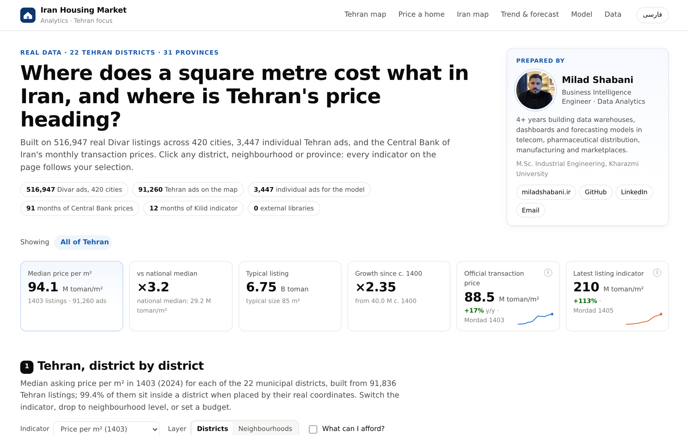
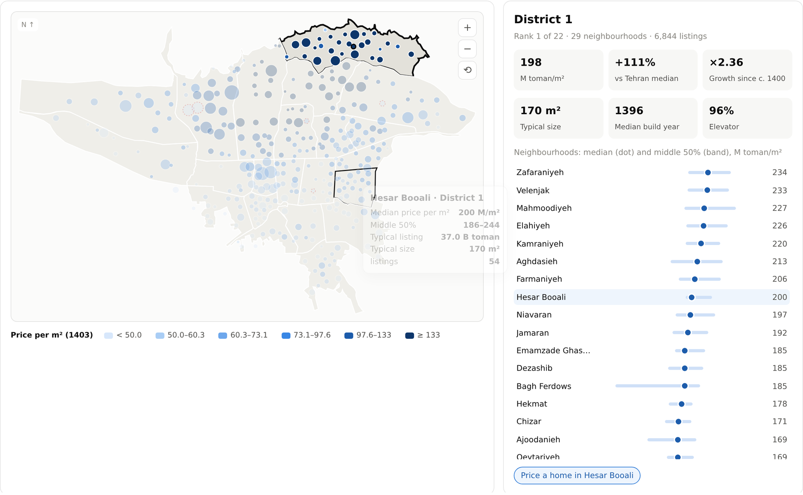
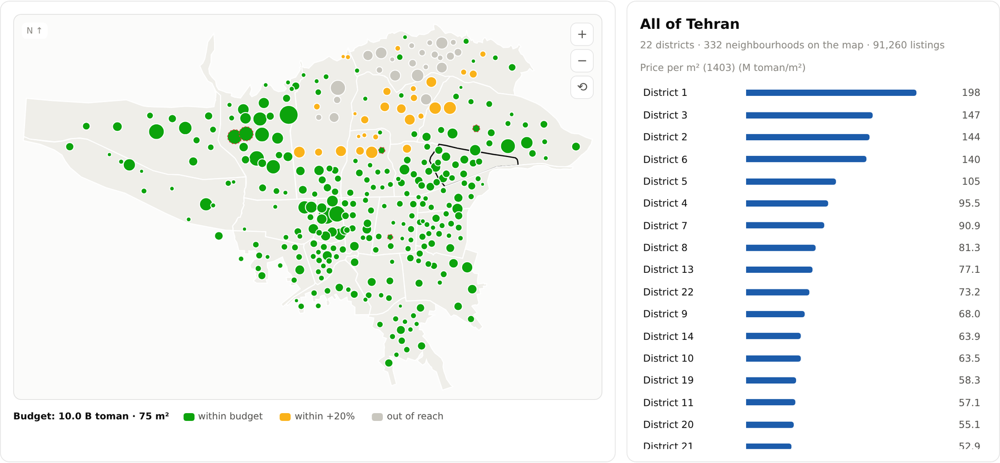
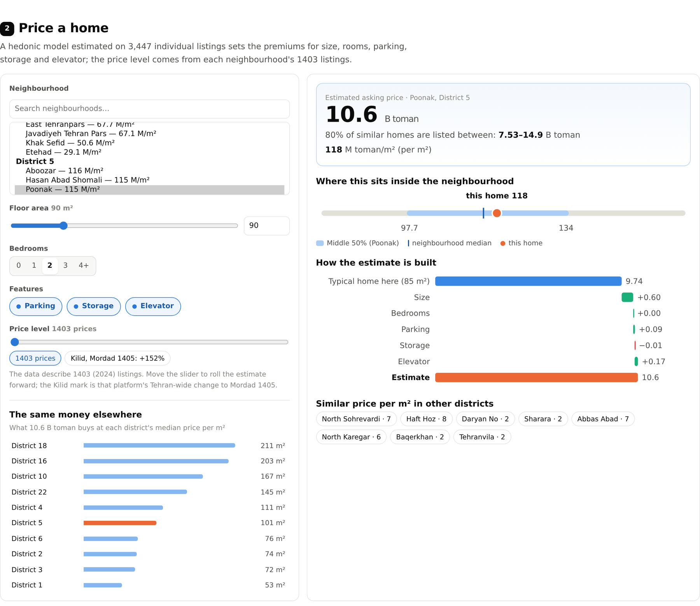
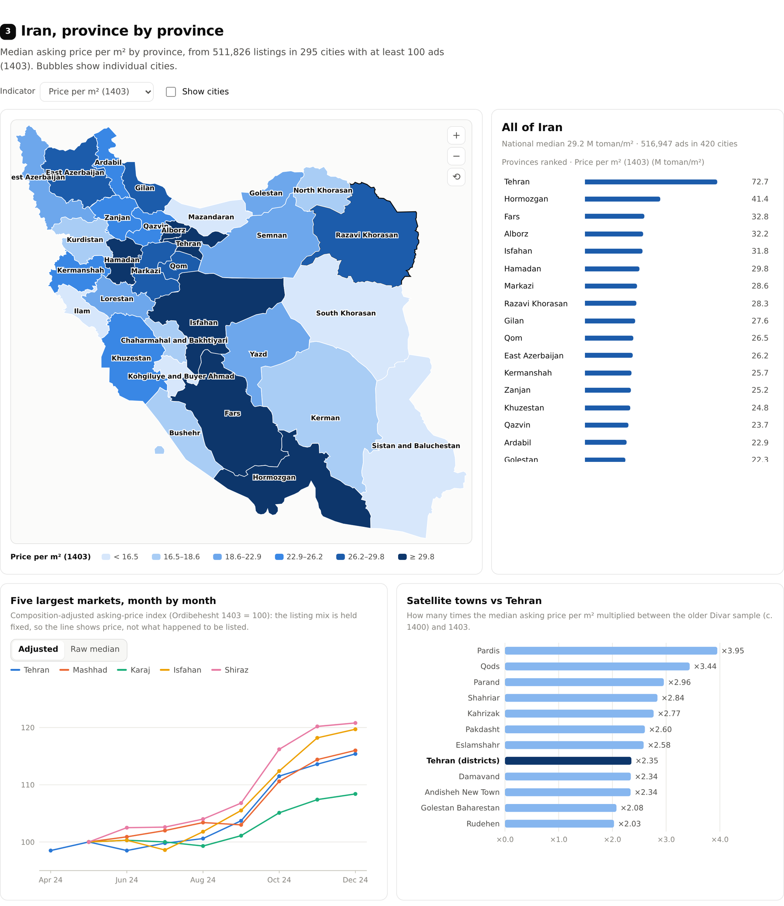
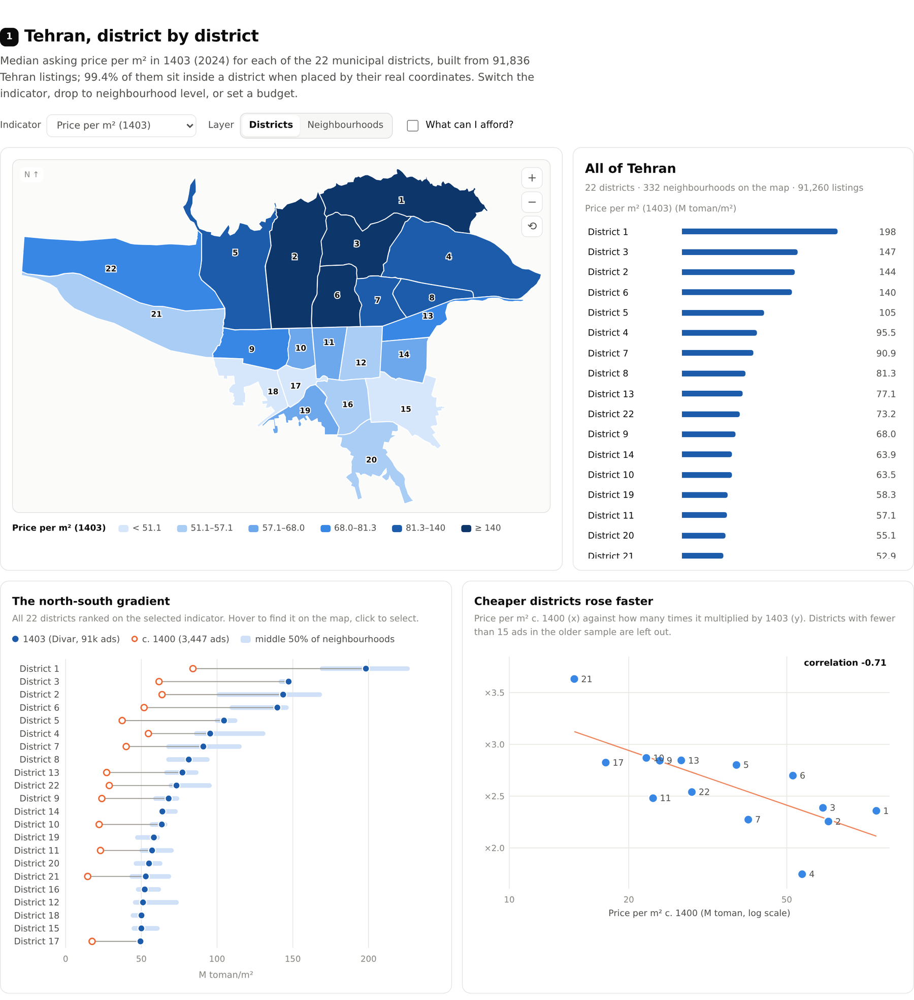
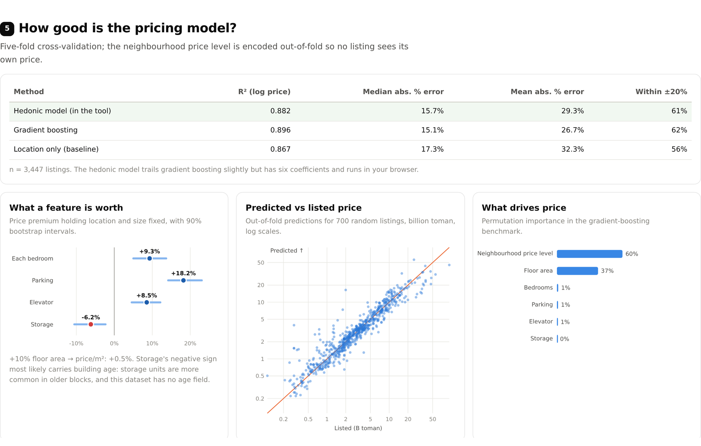
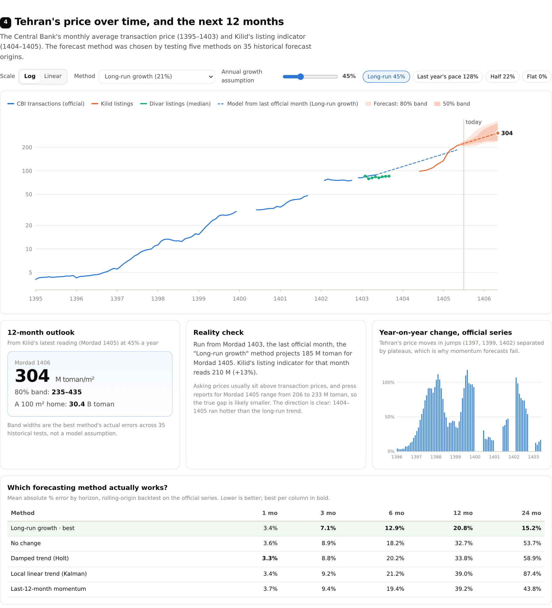

# Iran & Tehran Housing Market Analytics

**Where does a square metre cost what in Iran, and where is Tehran's price heading?** An interactive, map-first dashboard of the Iranian housing market with a district-by-district focus on Tehran, built on real listings and the Central Bank of Iran's transaction prices, with a pricing model you can run in the browser and a forecast whose error bands come from 35 historical tests.

[](https://milad-shabani.github.io/Iran-housing-market-analytics/)
[](https://milad-shabani.github.io/Iran-housing-market-analytics/index.fa.html)
[](#tests)
[](#how-it-is-built)
[](LICENSE)

<p align="center"></p>

---

## What is in it

| | |
|---|---|
| **Tehran map** | 22 municipal districts coloured by 8 indicators (price per m², growth, typical price, size, build year, elevator and parking share, sample size). Drop to 332 neighbourhoods, zoom and pan, or enter a budget and see which neighbourhoods fit. |
| **Price a home** | Pick a neighbourhood, set size, bedrooms, parking, storage and elevator. The estimate comes with an 80% range, a step-by-step breakdown, where it sits in the neighbourhood's price distribution, and what the same money buys in other districts. |
| **Iran map** | 31 provinces and 349 cities, from 514,282 real listings. Click a province to see its cities. |
| **Trend & forecast** | The Central Bank's monthly Tehran series (1395–1403), Kilid's listing indicator (1404–1405), and a 12-month outlook whose method and band widths come from a rolling-origin backtest. Change the growth assumption and watch the fan move. |
| **Model** | Cross-validated accuracy, what each feature is worth, predicted vs listed price. |

Every tile and chart follows the selection: click District 3 and the KPIs, the side panel, the ranking and the scatter all switch to District 3.

<table>
<tr><td width="50%"><br><sub>Neighbourhood level: each dot is a neighbourhood at Divar's median listing location, sized by listings.</sub></td>
<td width="50%"><br><sub>Budget mode: 10 billion toman for 75 m², green fits, amber is within 20%.</sub></td></tr>
<tr><td width="50%"><br><sub>Pricing tool: estimate, 80% range, position in the neighbourhood, step-by-step breakdown.</sub></td>
<td width="50%"><br><sub>Iran by province, with the five largest markets month by month and satellite towns against Tehran.</sub></td></tr>
</table>

## Findings

**1. The north–south gradient is 4×.** District 1 asks a median **198 M toman/m²** (1403); District 17 asks **49.4 M**. The three most expensive districts (1, 3, 2) are all in the north.

<p align="center"></p>

**2. Cheaper districts rose faster.** Between the older Divar sample (c. 1400) and 1403, District 21 multiplied **×3.63** and District 1 **×2.36**; across districts the correlation between the starting price and the multiple is **−0.71**. Satellite towns show the same pull: Pardis **×3.95**, Shahr-e Qods **×3.44**, against **×2.35** for Tehran's districts.

**3. The capital is in its own league.** Tehran province's listings ask **2.5×** the national median (72.7 vs 29.2 M toman/m²). The runner-up, Hormozgan, is at 41.4 M because of Kish and Bandar Abbas; Kohgiluyeh and Boyer-Ahmad is the cheapest at 7.0 M.

**4. Extrapolating last year is the worst forecast.** On the Central Bank's series, carrying forward the last 12 months' growth misses by **39%** at a one-year horizon; the long-run growth rate misses by **21%** and is the best of five methods at every horizon beyond one month. Tehran moves in jumps (1397, 1399, 1402) separated by plateaus.

**5. The last two years ran hot.** Projected from the last official month (Mordad 1403), the backtest winner gives **185 M toman/m²** for Mordad 1405; Kilid's listing indicator reads **210 M** (+13%), and press reports for that month range from 206 to 233 M.

**6. Location is most of the price.** A location-only baseline already reaches R² 0.87 on log price. Holding location and size fixed, parking adds **+18%**, an elevator **+9%**, each bedroom **+9%**.

<p align="center"></p>

<p align="center"></p>

## The data: what is real and what is derived

Nothing here is simulated. Each file in `data/raw/` traces to a public source, pinned in [`scripts/fetch_sources.py`](scripts/fetch_sources.py).

| Source | Used for | Coverage |
|---|---|---|
| [Divar official real-estate dataset](https://huggingface.co/datasets/divarofficial/real_estate_ads) (1M ads, ODbL), via the aggregates published in [maminigder/Iran-Real-Estate-Market-Analysis](https://github.com/maminigder/Iran-Real-Estate-Market-Analysis) | Tehran neighbourhoods and districts, cities and provinces, monthly city index | 516,947 residential sale ads, 420 cities, mostly 1403 (2024) |
| [Divar Tehran house prices](https://github.com/F-Yousefi/House_Price_Prediction) (Kaggle mirror) | Training the pricing model; the c. 1400 comparison | 3,479 individual ads (3,447 after cleaning) |
| [Central Bank of Iran](https://www.cbi.ir/category/16994.aspx), Tehran housing market reports | Official monthly price series, forecast backtest | 91 of 101 months, 1395/01–1403/05, each row with its source URL |
| [Kilid.com](https://kilid.com/house-prices/tehran) Tehran price indicator | Latest level and live forecast base | 12 months, 1404/06–1405/05 |
| [rferdosi/tehran-districts](https://github.com/rferdosi/tehran-districts), [OpenStreetMap via hosseinhabibi2004/iran-geojson](https://github.com/hosseinhabibi2004/iran-geojson) (ODbL) | District and province boundaries, county locations | 22 districts, 31 provinces, 475 counties |

Full column-level detail: [`docs/data_dictionary.md`](docs/data_dictionary.md). Method and every judgement call: [`docs/methodology.md`](docs/methodology.md).

### Improvements over the two earlier versions

This repository merges and replaces two drafts (a Tehran-only listings dashboard and an Iran-wide dashboard). What changed:

- **Province data is real now.** The earlier Iran map used illustrative tiers for 28 provinces; every province here comes from real listings.
- **Neighbourhoods are placed by data, not by hand.** Divar's own median listing coordinates plus point-in-polygon replace a hand-typed district lookup, which had placed Gholhak in District 1 and Darrous in District 4 (both are in District 3).
- **The time series is official, not calibrated.** The province trends were generated from three anchor prices; the Central Bank's published monthly series replaces them.
- **The forecast is chosen and bounded by a backtest**, and its bands are the method's real past errors.
- **KPIs follow the selection**, and the whole dashboard works without a CDN (the old Leaflet and Chart.js versions needed one, which fails for many users in Iran).

## How it is built

```
data/raw  ──►  src/iran_housing  ──►  data/processed  ──►  dashboard/  ──►  site/index.html
(pinned        listings.py  market.py       tidy CSVs +        template, CSS,     self-contained
 sources)      timeseries.py valuation.py   dashboard_data     JS, strings        EN + FA pages
               geo.py  export.py            .json
```

- **Geography.** District polygons and OSM province outlines are projected once in Python into SVG paths; the browser only draws them. `DistrictLocator` assigns each neighbourhood's median coordinate to a district (99.4% of Tehran listings land inside one).
- **Aggregation.** District and province figures are listing-weighted medians of neighbourhood or city medians, because the 1M-ad release publishes medians, not raw ads.
- **Valuation.** OLS on log price with an out-of-fold neighbourhood encoding, benchmarked against gradient boosting and a location-only baseline under 5-fold CV. In the browser the coefficients move the price away from each neighbourhood's typical 1403 listing.
- **Forecast.** Five methods (no change, long-run growth, 12-month momentum, damped Holt, local linear trend via Kalman filter) scored on every forecast origin of the official series with data 1–24 months later.
- **Dashboard.** Hand-written SVG maps and charts in about 1,000 lines of plain JavaScript. No libraries, no network requests; the Persian page embeds the Vazirmatn font. Opens from disk.

## Run it

```bash
pip install -r requirements.txt
python scripts/run_pipeline.py      # clean, locate, summarise, model, forecast -> data/processed/
python scripts/build_dashboard.py   # -> site/index.html and site/index.fa.html
pytest -q                           # 41 tests
```

`make all` does the same. To refresh or audit the raw layer from the upstream files: `python scripts/fetch_sources.py --check`, then `python scripts/prepare_geo.py`.

## Adding Divar data for 1404–1405

Divar's public 1M-ad release ends in 1403, and no newer Divar dataset is published. The live
Divar app does have current listings, so the repository ships a collector for them.
`divar.ir` has to be reachable from where you run it (it is from inside Iran):

```bash
python scripts/collect_divar.py collect      # Tehran apartment-for-sale ads, ~5-10 minutes at a polite pace
python scripts/collect_divar.py aggregate    # -> data/raw/divar_1405/ (medians only)
python scripts/run_pipeline.py && python scripts/build_dashboard.py
```

The collector tiles Tehran into map rectangles on Divar's web map endpoint, which returns up to
200 ads per rectangle with size, rooms, building age, parking and elevator flags, coordinates
and a rounded price. Rectangles with more ads are split until every ad is returned. Individual
ads stay in `data/local/` (git-ignored). Only neighbourhood and district medians are written to
`data/raw/divar_1405/`. Once they exist, the dashboard gains a *Price per m² (1405)* indicator, a
*Change 1403 → 1405* indicator and a 1405 KPI tile. Without them the page is unchanged.

## Tests

41 tests in [`tests/`](tests/): Jalali calendar conversion, raw-file shapes, every official value carrying a URL, unit consistency across the Central Bank transcriptions, landmarks (Tajrish, Vanak, Azadi Tower, Chitgar lake, Shahr-e Rey) landing in the right district, the north–south gradient, Tehran as the most expensive province, the model beating its baseline, forecasts using only past data, both pages being free of external requests, and the Divar collector's parsing and aggregation.

## Repository layout

```
├── data/
│   ├── raw/           divar_1m/, divar_2021/, official/ (CBI, Kilid)
│   ├── geo/           districts, provinces, counties, name tables, author-assigned lookups
│   └── processed/     pipeline outputs (regenerable)
├── src/iran_housing/  jalali, geo, listings, market, valuation, timeseries, export
├── scripts/           fetch_sources, prepare_geo, run_pipeline, build_dashboard
├── dashboard/         template.html, styles.css, app.js, i18n.json, content.json, fonts/
├── site/              the built dashboard (published by GitHub Pages)
├── docs/              methodology, data dictionary, screenshots
└── tests/
```

## Limits

- Divar prices are **asking** prices; the Central Bank series is **completed transactions**. They appear side by side and are never blended into one number.
- The 3,447-ad sample is undated. Its level matches the Central Bank average of spring–summer 1401 and its USD column implies 30,000 toman/$; it is labelled "c. 1400".
- The Central Bank stopped publishing after Mordad 1403 and Kilid's indicator starts in Shahrivar 1404: the 12 months in between have no series here.
- Five neighbourhoods whose median sits below 45% of their district's are flagged as probable mixed listings, shown on the map and excluded from district figures.
- A one-year forecast has missed by 21% on average even with the best method. Read the bands, not the line. Not investment advice.

## Author

**Milad Shabani** — Business Intelligence & Data Analytics
[miladshabani.ir](https://miladshabani.ir) · [GitHub](https://github.com/Milad-Shabani) · [LinkedIn](https://www.linkedin.com/in/milad-shabani97/)

Code: MIT. Data: under each source's licence (Divar data and OpenStreetMap boundaries ODbL); see [DATA_LICENSE.md](DATA_LICENSE.md).
